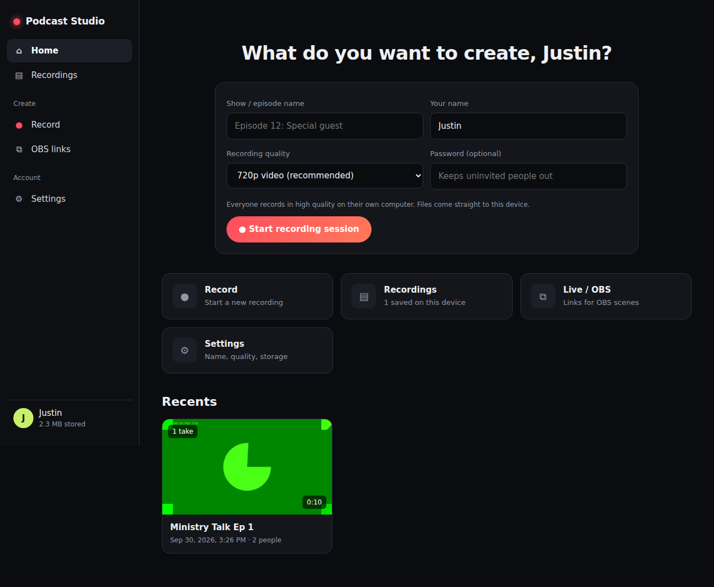
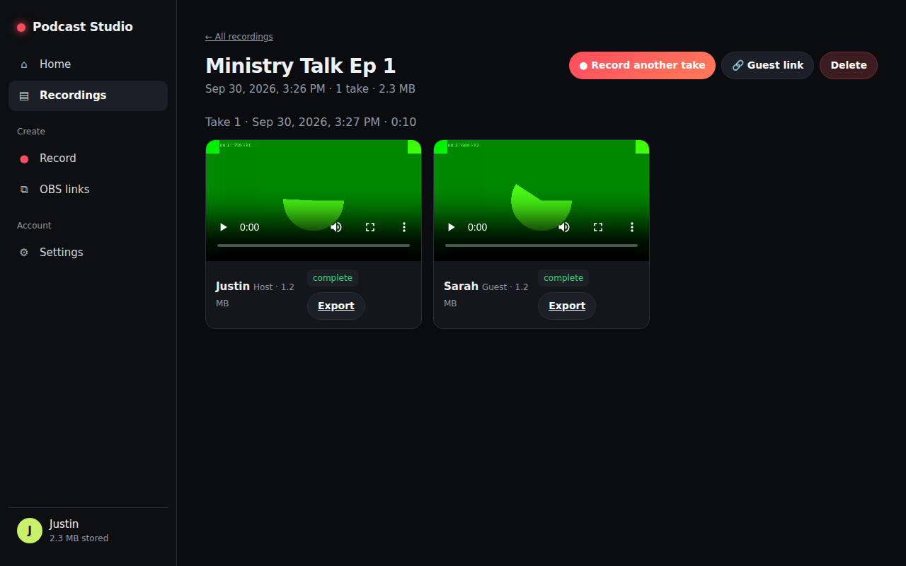

# Podcast Studio (self-hosted Riverside alternative)

Remote podcast recording built on **VDO.Ninja** (browser WebRTC for guests) and
**OBS Studio** (mixing, recording, streaming).

```
Guest browser ──WebRTC (P2P, TURN fallback)──▶ Host PC: OBS (one Browser Source per guest)
      │                                                  │
      └─ optional local recording (&record) ─▶ files ─▶ scripts/ post-production
```

## Layout
| Path | What |
|---|---|
| `deploy/` | Docker Compose: Caddy (HTTPS) + self-hosted VDO.Ninja + coturn |
| `site/` | Branded join / director / OBS-link pages |
| `scripts/` | Post-production: loudness normalize, mixdown, transcripts |
| `obs/` | OBS setup notes |
| `docs/` | Episode runbook |

## Live site
**https://ministryai.github.io/Podcast/**

| Dashboard | A recording |
|---|---|
|  |  |

- **Dashboard** (`site/index.html`, `site/dashboard.js`): start sessions, see recents, browse
  every recording, play and export tracks, record more takes into an existing session, settings.
- **Studio** (`site/studio.html`, `site/studio.js`): green room, then a branded call on top of
  self-hosted VDO.Ninja (`/app/`), driven through its iframe API.
- **Recording** (`site/lib/recording.js`): Riverside-style. Every person records their own
  camera and mic locally (MediaRecorder). Guests stream their file to the host *during* the
  recording over an extra binary data channel on the existing WebRTC connection, with byte
  offsets, backpressure and resume. **No downloads for anyone.** Files are stored in the
  host browser's private storage (OPFS, `site/lib/store.js`, written from a worker), and the
  guest's temporary copy is deleted once the host confirms receipt.

Deploys via `.github/workflows/pages.yml` on every push.

## Quick start
**Phase 1 – zero cost, no server:** open `site/index.html` locally, keep the
default server `https://vdo.ninja`, generate links, send guest links, paste the
OBS links into Browser Sources. See `docs/runbook.md`.

**Phase 2 – self-host:** see `deploy/README.md`.
