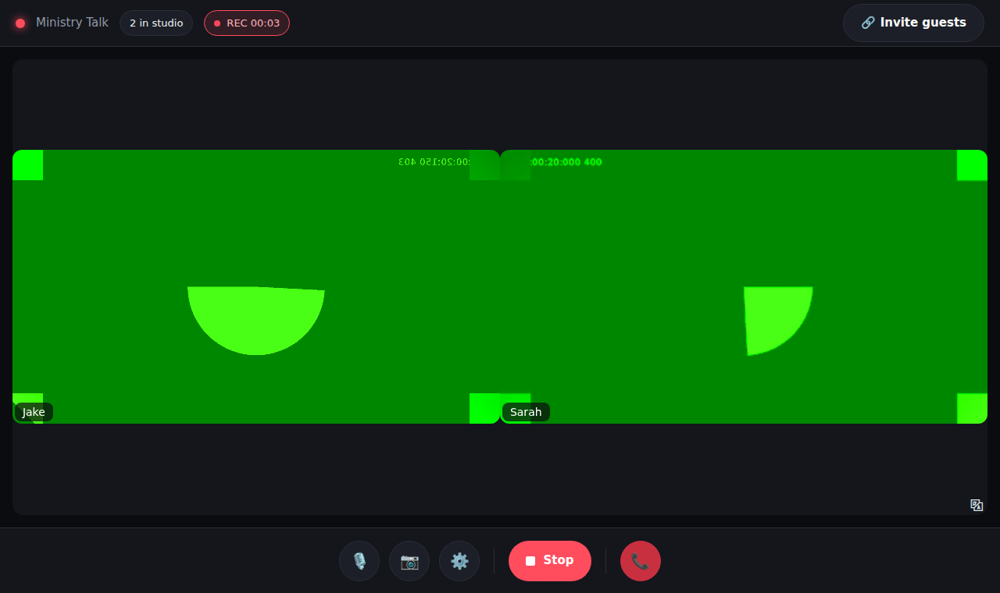

# Podcast Studio (self-hosted Riverside alternative)

Remote podcast recording built on **VDO.Ninja** (browser WebRTC for guests) and
**OBS Studio** (mixing, recording, streaming).

```
Guest browser ──WebRTC (P2P, TURN fallback)──▶ Host PC: OBS (one Browser Source per guest)
      │                                                  │
      └─ optional local recording (&record) ─▶ files ─▶ scripts/ post-production
```

## Layout
| Path | What |
|---|---|
| `deploy/` | Docker Compose: Caddy (HTTPS) + self-hosted VDO.Ninja + coturn |
| `site/` | Branded join / director / OBS-link pages |
| `scripts/` | Post-production: loudness normalize, mixdown, transcripts |
| `obs/` | OBS setup notes |
| `docs/` | Episode runbook |

## Live site
**https://ministryai.github.io/Podcast/**: your own branded studio
(start session → green room → studio with invite, mute, camera, Record and leave).
Old OBS link generator: `/Podcast/tools/`.



How it works: `site/studio.js` embeds VDO.Ninja (`/app/`) in an iframe, hides its UI
(`site/vdo.css`), and drives it through the VDO.Ninja iframe API. Hitting **Record**
starts a local high-quality recording on *every* participant's computer (files land in
each person's Downloads). Late joiners are pulled into an in-progress recording.
VDO.Ninja itself is served from **https://ministryai.github.io/podcast/app/**.
Both are deployed by `.github/workflows/pages.yml` on every push and refreshed weekly.

One-time: repo **Settings → Pages → Source: GitHub Actions**.

## Quick start
**Phase 1 – zero cost, no server:** open `site/index.html` locally, keep the
default server `https://vdo.ninja`, generate links, send guest links, paste the
OBS links into Browser Sources. See `docs/runbook.md`.

**Phase 2 – self-host:** see `deploy/README.md`.
